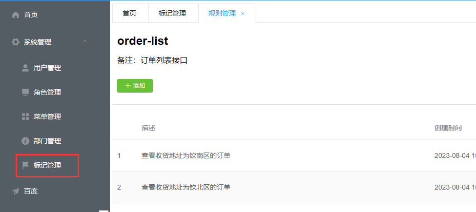

# wonder-web

#### 前端 https://gitee.com/whzzone/wonder-web

#### 后端 https://gitee.com/whzzone/wonder-server

#### API文档地址：http://wonder.weihuazhou.top/wonder-server/doc.html

#### Bug && Todo
1. 点击页面上按钮(不是菜单栏上的)打开新的标签页时，侧边栏保持原来的菜单高亮
    
2. 无需重新登录就可以更新路由
3. ~~新增了rule-index后刷新会跳回登录页，提示没有token~~
4. ~~有时登录成功后无法跳转首页，也没有报错，但是新开一个无痕窗口就能正常登录~~
5. 根据后配置的菜单keepAlive设置缓存
6. 在首页点击百度没问题，但进入二级目录后打开百度有问题，`meta变空了`，url前面拼接了/system
7. 重新选择角色后，需要重新生成菜单
    
8. ~~当规则的提供方法选择时值时，表达式只能选`in`、`not in`~~
9. 当打开登录页时就可以去获取无需登录就可以访问的菜单并生成路由
10. ~~设置 `/` 为`hello`是跳转登录页失败~~
11. 规则编辑的时候，没有回显实参、形参

## Project setup
```
yarn install
```

### Compiles and hot-reloads for development
```
yarn serve
```

### Compiles and minifies for production
```
yarn build
```

### Lints and fixes files
```
yarn lint
```

### Customize configuration
See [Configuration Reference](https://cli.vuejs.org/config/).
